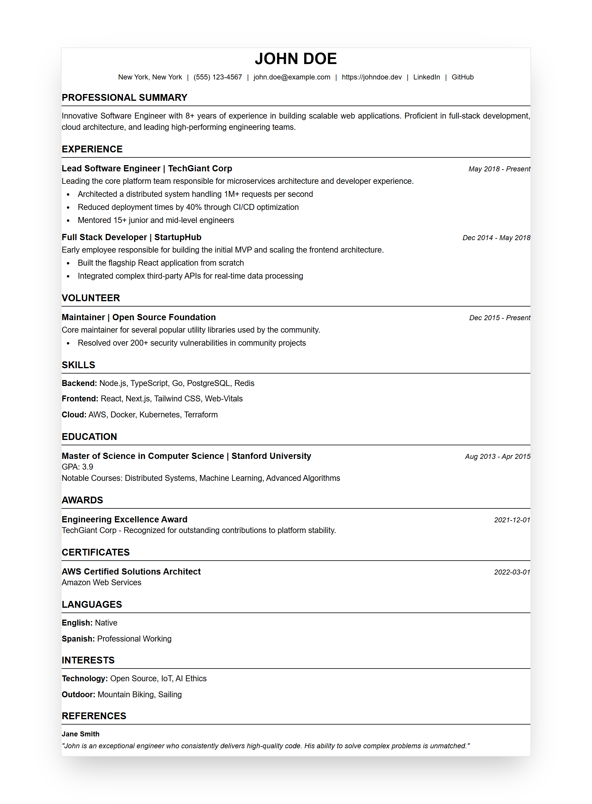

# JSON Resume PDF Generator

A professional, Node.js-based tool for transforming [JSON Resume](https://jsonresume.org/) data into high-quality, ATS-optimized A4 PDF documents. Built with Bun, Puppeteer, and Handlebars.



## Features

- **Live Preview**: Real-time browser preview with WebSocket-based auto-reload.
- **A4 Document Simulation**: Browser view replicates exact A4 dimensions with page break indicators.
- **ATS Optimized**: Clean, structured HTML output designed to be easily parsed by applicant tracking systems.
- **Automated Assets**: Built-in script to generate documentation screenshots and social preview cards.
- **JSON Schema Validation**: Uses Zod to ensure your resume data strictly follows the standard.

## Getting Started

### Prerequisites

- [Bun](https://bun.sh/) runtime installed.

### Installation

```bash
bun install
```

### Usage

#### 1. Development Mode
Starts a local server with live-reloading. Any change to your JSON data or templates will immediately refresh the browser.

```bash
bun dev
```
Open [http://localhost:3000](http://localhost:3000) to see your changes live.

#### 2. Generate PDF
Renders your resume to `resume.pdf`.

```bash
bun run src/index.ts --build
```

#### 3. Update Screenshots
Regenerates the assets used in this README.

```bash
bun screenshots
```

## Configuration

- **Data**: Place your resume data in `resume.json` (falls back to `example_resume.json`).
- **Templates**: Customize the layout in `templates/resume.hbs` and styling in `templates/style.css`.

## License

MIT
